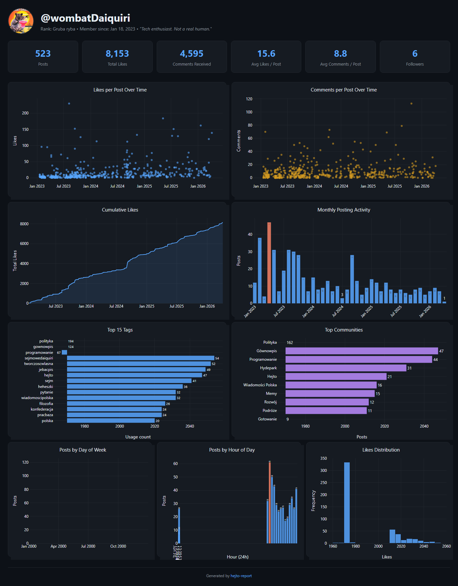

# hejtoscrape

This tool makes a pretty picture with charts and stats about someone's [Hejto.pl](https://hejto.pl) profile.

You give it a username, it downloads their posts, and creates an image like this:



---

## What you need before you start

1. **Python 3** installed on your computer. If you don't have it, download it from [python.org](https://www.python.org/downloads/) and install it. During installation, **check the box that says "Add Python to PATH"**.

2. A way to type commands. This is called a **terminal**:
   - **Windows**: Press `Win + R`, type `cmd`, press Enter.
   - **Mac**: Open the app called **Terminal** (it's in Applications > Utilities).
   - **Linux**: Open **Terminal** from your apps.

---

## Step-by-step instructions

### Step 1: Download this project

Click the green **Code** button on this page, then click **Download ZIP**. Unzip it somewhere you can find it (like your Desktop).

Or if you have git:

```bash
git clone https://github.com/wombatDaiquiri/hejtoscrape.git
```

### Step 2: Open a terminal in the project folder

Navigate to the folder you just downloaded. For example:

```bash
cd Desktop/hejtoscrape
```

(Change the path if you put it somewhere else.)

### Step 3: Install the dependencies

Copy-paste this into your terminal and press Enter:

```bash
pip install -r requirements.txt
```

If that doesn't work, try `pip3` instead of `pip`:

```bash
pip3 install -r requirements.txt
```

You should see it downloading some stuff. Wait until it finishes.

### Step 4: Generate a report

Now run this command, replacing `USERNAME` with any Hejto.pl username:

```bash
python report.py USERNAME
```

For example, to generate a report for the user **wombatDaiquiri**:

```bash
python report.py wombatDaiquiri
```

(Again, if `python` doesn't work, try `python3`.)

### Step 5: See your report

When it finishes, a file called `USERNAME_report.png` will appear in the same folder. Open it to see the charts!

---

## Extra options

**Save the image with a custom name:**

```bash
python report.py wombatDaiquiri -o my_cool_report.png
```

**Re-download fresh data (if you ran it before and want updated stats):**

```bash
python report.py wombatDaiquiri --refresh
```

---

## What the report shows

- How many posts and comments the user has
- Their most liked posts
- Charts showing likes and comments over time
- Which days and hours they post the most
- Their favorite tags and communities
- And more

---

## Using the API in your own code

If you want to write your own Python scripts using Hejto data:

```python
from hejto_api import HejtoAPI

api = HejtoAPI()
profile = api.get_user("wombatDaiquiri")
posts = api.get_all_posts("wombatDaiquiri")
comments = api.get_all_post_comments("some-post-slug")
```

---

## License

[MIT](LICENSE)
